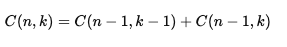
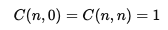

# PascalTriangle
A c++ program to compute Pascals Triangle using recursion and Memoization.

Pascal's Triangle program using recursion. Here we implement a recursive function to calculate the entries of Pascal's Triangle based on the recursive formula:

with base cases:

